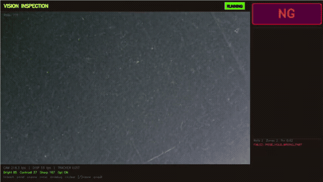
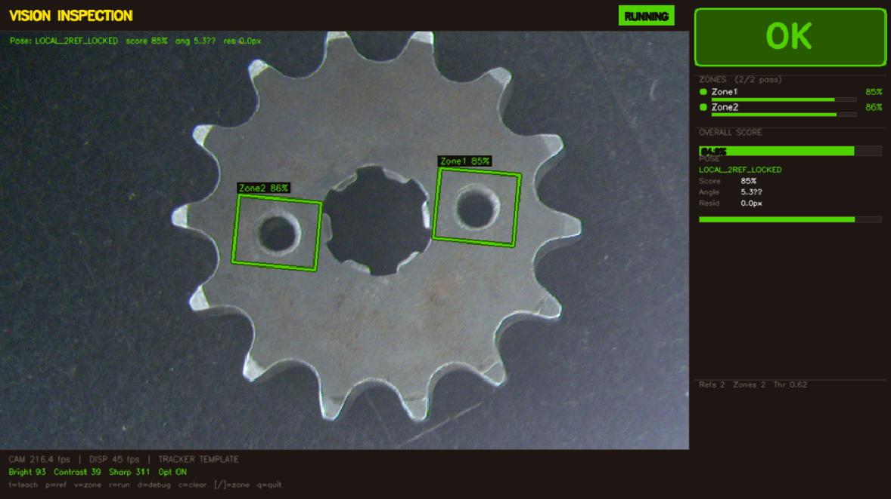
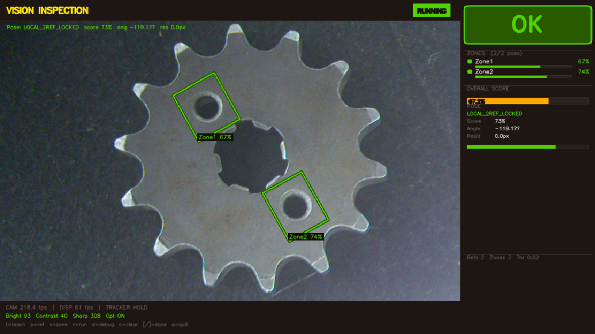
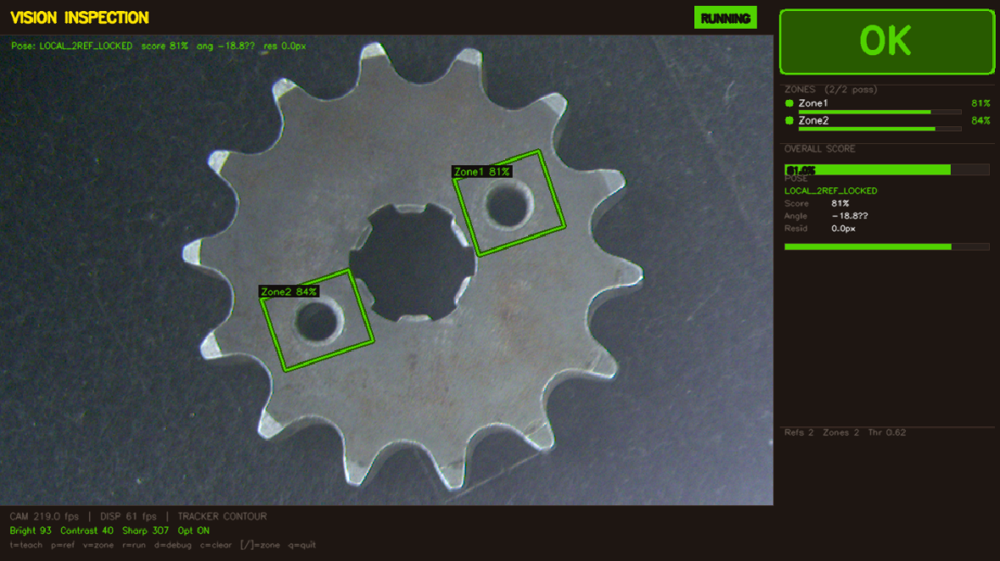
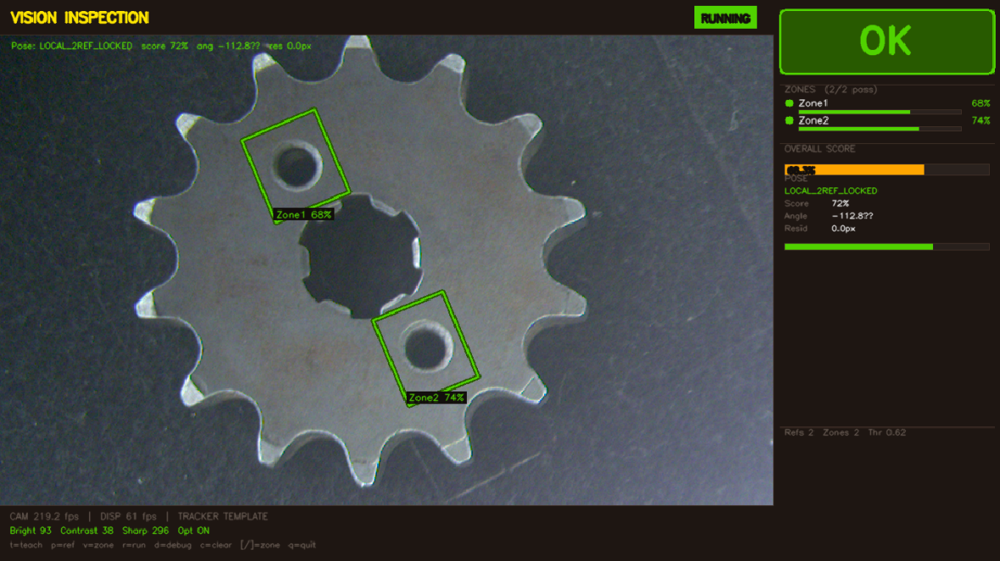
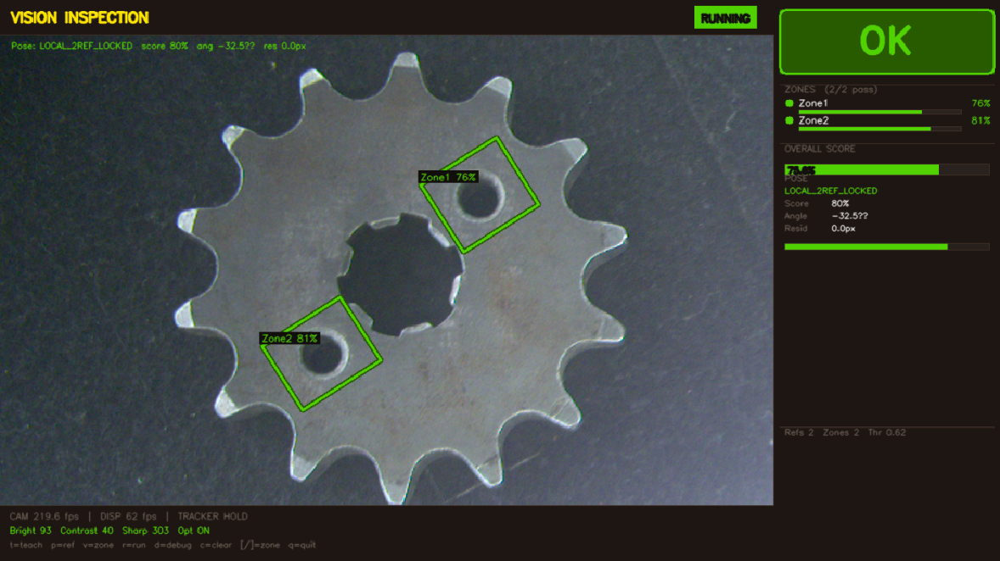

# AI Vision Inspection System

**A real-time OK/NG presence/absence inspection system for manufactured parts, written in Python and OpenCV.** You teach it one good part. It then checks every part for missing features (holes, screws, washers, components) and gives an instant **OK** or **NG**, even when the part is rotated or moved. I built it during my industrial internship, and it runs on an **NVIDIA Jetson Orin Nano** edge computer with a Basler industrial camera.


---

## Working Demonstration



[▶ Watch the full demo video](media/demo.mp4): teach the master, place the reference and inspection zones, then run live inspection on rotated and moved parts, plus NG detection.

| Rotated 0° | Rotated | Rotated | Rotated | Rotated |
|---|---|---|---|---|
|  |  |  |  |  |

The same part is placed at different angles. The zones follow the part, and the verdict stays **OK**.

---

## Key features

- **Teach by example:** no model training or labelled dataset is needed. Teach one good part, mark the features that must be present, and run.
- **Rotation- and position-tolerant:**
  - A multi-template tracker (NCC template matching with periodic ORB and contour fallback) locks onto the part.
  - Two reference zones correct its position and angle before the inspection zones are checked.
- **Zone-by-zone OK/NG:** every inspection zone gets a live similarity score. The part is **OK** only when all required zones pass, and the failing zones are highlighted in red.
- **Stable verdicts:** hysteresis plus multi-frame confirmation stops OK/NG flicker. When the part is lost briefly, the last good result is held.
- **Built for speed:**
  - Tracking runs in a background thread.
  - The search is restricted to a window around the last known position.
  - Expensive matchers run only every few frames.
- **Camera-agnostic:**
  - Basler industrial cameras via `pypylon`.
  - Any OpenCV/USB webcam.
  - A phone camera over the *IP Webcam* app.
  - A software mock camera for testing.
- **Robust preprocessing for metallic parts:** LAB L-channel with **CLAHE** contrast enhancement, edge evidence, and contour/mask extraction, with debug overlays.
- **Hole detection and presence/absence checks:** hole-mask generation and profile extraction for sprocket/gear-like parts.
- **36-angle part pose handling:** parts can be inspected at any rotation.
- **PLC integration over Modbus TCP:** the PLC triggers each inspection and the system writes the verdict back on coils:

  | Signal | Modbus coil |
  |---|---|
  | Trigger (PLC → vision) | `00007` |
  | OK (vision → PLC) | `00116` |
  | NG (vision → PLC) | `00117` |
  | DONE (vision → PLC) | `00101` |

- **PyQt6 operator UI:**
  - A launcher plus a camera-settings screen.
  - A dark industrial theme with mouse/touch controls and a big OK/NG banner.
  - FPS and image-quality readouts (brightness, contrast, sharpness).

## Hardware

| Part | Role |
|---|---|
| **NVIDIA Jetson Orin Nano** | Edge computer that runs the inspection software (Ubuntu + Python + OpenCV) |
| **Basler acA2440-75uc** industrial camera (via `pypylon`) | Image capture at the inspection station |
| Alternatives for testing | Any USB webcam, a phone camera (IP Webcam app), or the built-in mock camera |

The software is plain Python + OpenCV, so it also runs on a normal Windows or Linux PC for development.

## Architecture

```
main_gui.py ─┬─► presence_absence_main.py ─► apps/presence_absence_app.py
             └─► camera_settings_gui.py

processing/
├── camera/                    camera_manager.py (Basler / OpenCV), threaded_camera.py
├── engines/presence_absence.py  per-zone presence scoring
├── multi_template_tracker.py  finds and follows the part (NCC + ORB + contour)
├── position_corrector.py      pose from reference zones (shift + rotation)
├── inspection_plan.py         master image, reference zones, inspection zones
├── roi_comparator.py          per-zone scoring + debounced OK/NG decision
├── zone_feature_profile.py    per-zone feature training (hole/blob/edge type)
├── auto_anchor_selector.py    automatic reference-anchor suggestion
├── image_optimizer.py         contrast / quality metrics
├── perf_monitor.py            timing diagnostics
├── config/app_config.py       display layout (overridable via config/app_config.json)
└── theme.py                   shared UI colours
```

More detail is in [docs/how_it_works.md](docs/how_it_works.md).

## How it is used

1. Press **A** for an automatic ROI, or draw an ROI around the part, then press **T** to teach the master.
2. Draw a position reference and press **P**. Repeat for a second reference.
3. Draw an inspection zone and press **V**. Repeat for each feature that must be present.
4. Press **R** to run. Other keys: **D** debug, **C** clear, **Q** quit.

The inspection runs on the NVIDIA Jetson Orin Nano with a Basler camera. For development and testing it also runs on a Windows or Linux PC, with a USB webcam, a phone camera or the built-in mock camera.

## Source code

The source code is kept in a **private repository**. It is available to recruiters and interviewers on request: contact me via [GitHub @dhanushanand-dev](https://github.com/dhanushanand-dev).

This public repository is a showcase. It contains the README, the [technical write-up](docs/how_it_works.md) and the demo media (`media/`).

The private source repository is laid out like this:

```
├── main_gui.py                 # launcher
├── camera_settings_gui.py      # camera exposure / gain / resolution
├── presence_absence_main.py    # inspection entry point
├── apps/                       # presence/absence inspection application
├── processing/                 # vision core (see Architecture)
├── config/camera_settings.json # camera settings
├── models/                     # taught masters are saved here (git-ignored)
├── tests/                      # smoke test
├── docs/                       # how it works
└── media/                      # demo video, GIF, screenshots
```

It includes a camera-free smoke test of the tracker and zone comparator.

## Skills demonstrated

- Computer vision with OpenCV: template matching, ORB features, contours, affine pose estimation, zone similarity scoring
- Real-time systems: threaded capture and processing, performance tuning, frame-level debouncing
- Industrial machine-vision workflow: teach/inspect, reference and inspection zones, OK/NG decisions
- Edge deployment and hardware integration: NVIDIA Jetson Orin Nano, Basler industrial cameras (pypylon), USB and IP cameras
- Python software design: modular processing pipeline, dataclasses, configuration, PyQt6 operator UI
- Industrial integration: Modbus TCP handshake with a PLC (trigger / OK / NG / DONE)

## Notes

- Taught masters are saved locally on the inspection computer. Each new part type is taught from one good sample.
- This uses classical computer vision (OpenCV), not a trained deep-learning model, so it works from a single good sample.

## Roadmap

- Scratch and dent detection using YOLO-based segmentation (planned, not yet implemented).
- Measured accuracy, cycle time and false-reject rate on production parts.

## Author

**Dhanush Anand** · [GitHub @dhanushanand-dev](https://github.com/dhanushanand-dev) · [LinkedIn](https://linkedin.com/in/dhanushanand-dev)
